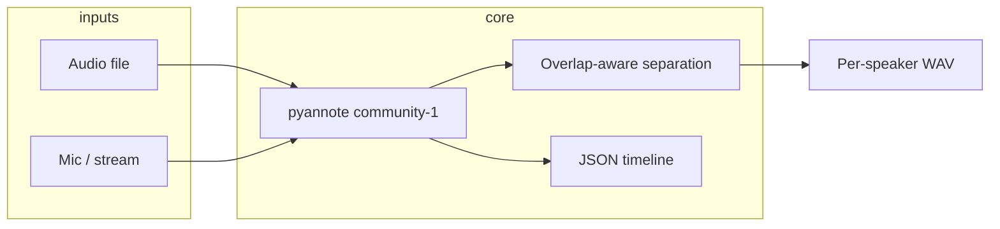

# speaker-sep

GPU-accelerated **speaker diarization** (who spoke when) with:

- **Inputs**: audio files and real-time streams (microphone or chunked file simulation)
- **Outputs**: per-speaker WAV files + **JSON timeline** (overlap-aware)
- **Models**: [pyannote/speaker-diarization-community-1](https://huggingface.co/pyannote/speaker-diarization-community-1) (pyannote.audio 4.x)
- **Constraints**: variable speaker count, overlapping speech, CUDA when available

Designed for meetings, simultaneous dialogue, and noisy public venues (concerts, halls, panels).

## Requirements

- Python 3.10+
- **ffmpeg** (for torchcodec / pyannote decoding)
- NVIDIA GPU recommended (CUDA)
- Hugging Face token with accepted model terms

## Setup

```bash
# ffmpeg (Ubuntu)
sudo apt-get install -y ffmpeg

python -m venv .venv
source .venv/bin/activate
pip install -e ".[dev]"

cp .env.example .env
# Edit HF_TOKEN in .env
```

Accept terms:

1. https://huggingface.co/pyannote/speaker-diarization-community-1  
2. Create token: https://huggingface.co/settings/tokens  

## Usage

### Audio file (batch, best quality)

```bash
speaker-sep file meeting.wav -o outputs/meeting
```

### Crowd / public venue (`--scene crowd`)

군중·공연장·광장처럼 **배경 소음이 크고 화자가 많을 때**는 `--scene crowd`를 쓰세요.  
오디오가 모델에 **어떻게 들어가는지**를 `ingest.json`에 기록합니다.

```bash
speaker-sep file plaza_recording.wav --scene crowd -o outputs/plaza
speaker-sep stream mic --scene crowd -o outputs/live_crowd
speaker-sep scenes   # 프리셋 설명 보기
```

**군중 모드 ingest 경로 (요약):**

```
마이크/파일 (스테레오 가능)
  → [1] 채널 선택: 음성 대역(300–3400Hz) 에너지가 가장 큰 채널만 사용 (평균 다운믹스 X)
  → [2] 16 kHz 리샘플
  → [3] 전처리: 80Hz 하이패스 + RMS 정규화 + 소프트 노이즈 게이트
  → [4] pyannote community-1 (clustering threshold ↑ → 군중 잡음에 잘게 쪼개지는 것 완화)
  → [5] 후처리: 0.35s 미만 발화 제거 + 발화 시간 상위 8명 dominant 화자만 유지
  → timeline.json + speakers/*.wav
```

| 단계 | 군중에서 왜 중요한가 |
|------|---------------------|
| 채널 선택 | 한쪽 마이크만 바람/군중 노이즈가 클 때 평균하면 신호가 죽음 |
| 노이즈 게이트 | 웅성거림 구간을 약화해 segmentation이 “전원 발화”로 오인하는 것을 줄임 |
| 긴 스트림 윈도우 (20s) | 짧은 윈도우는 군중 babble에서 화자 ID가 자주 바뀜 |
| dominant 상위 N명 | 수백 명을 전부 분리하는 것은 불가능; **가장 또렷한 화자**에 집중 |

환경 변수: `SPEAKER_SEP_SCENE=crowd`

### Real-time stream

```bash
# Microphone
speaker-sep stream mic -o outputs/live

# Simulate stream from file (for testing)
speaker-sep stream sample.wav --max-duration 60 -o outputs/sim
```

Streaming uses a **sliding window** (default 10s window, 0.5s step). Tune latency vs accuracy:

```bash
speaker-sep stream mic --window 8 --step 0.5
```

## Output layout

```
outputs/<name>/
  timeline.json      # speaker segments, overlap flags
  speakers/
    SPEAKER_00.wav   # full-length track with silence elsewhere
    SPEAKER_01.wav
```

### `timeline.json` (excerpt)

```json
{
  "source": "meeting.wav",
  "sample_rate": 16000,
  "speakers": ["SPEAKER_00", "SPEAKER_01"],
  "segments": [
    {
      "speaker": "SPEAKER_00",
      "start": 0.5,
      "end": 3.2,
      "overlap": false
    },
    {
      "speaker": "SPEAKER_01",
      "start": 10.0,
      "end": 10.8,
      "overlap": true,
      "co_speakers": ["SPEAKER_00"]
    }
  ],
  "meta": {
    "pipeline": "pyannote/speaker-diarization-community-1",
    "device": "cuda",
    "mode": "file"
  }
}
```

## Configuration (environment)

| Variable | Default | Description |
|----------|---------|-------------|
| `HF_TOKEN` | — | Hugging Face access token (required) |
| `SPEAKER_SEP_PIPELINE` | `pyannote/speaker-diarization-community-1` | Model pipeline |
| `SPEAKER_SEP_DEVICE` | `auto` | `auto`, `cuda`, or `cpu` |
| `SPEAKER_SEP_STREAM_WINDOW_SEC` | `10.0` | Streaming analysis window |
| `SPEAKER_SEP_STREAM_STEP_SEC` | `0.5` | Streaming inference interval |

Optional hints: `--min-speakers` / `--max-speakers` when you have prior knowledge.

## Architecture



- **File mode**: full-file inference (highest accuracy).
- **Stream mode**: sliding-window inference + embedding-based speaker ID merge across windows.
- **Separation**: frame masks from diarization; overlapping regions use energy splitting (`sqrt` by default) to reduce artifacts in dense overlap.

## Limitations

- Per-speaker WAVs are **mask-based**, not full blind source separation. Heavy overlap (e.g. choir + crowd) may still leak between tracks; for broadcast-grade separation consider adding a dedicated separation model later.
- Streaming trades latency for accuracy; very short windows degrade speaker counting in large crowds.
- First run downloads large models from Hugging Face.

## License

MIT
