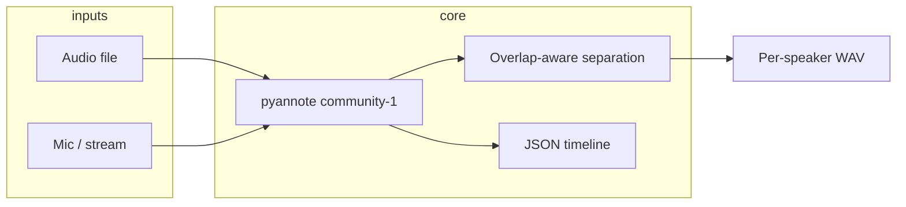

# speaker-sep

GPU-accelerated **speaker diarization** (who spoke when) with:

- **Inputs**: audio files and real-time streams (microphone or chunked file simulation)
- **Outputs**: per-speaker WAV files + **JSON timeline** (overlap-aware)
- **Models**: [pyannote/speaker-diarization-community-1](https://huggingface.co/pyannote/speaker-diarization-community-1) (pyannote.audio 4.x)
- **Constraints**: variable speaker count, overlapping speech, CUDA when available

Designed for meetings, simultaneous dialogue, and noisy public venues (concerts, halls, panels).

## Requirements

- Python 3.10+
- **ffmpeg** (for torchcodec / pyannote decoding)
- NVIDIA GPU recommended (CUDA)
- Hugging Face token with accepted model terms

## Setup

```bash
# ffmpeg (Ubuntu)
sudo apt-get install -y ffmpeg

python -m venv .venv
source .venv/bin/activate
pip install -e ".[dev]"

cp .env.example .env
# Edit HF_TOKEN in .env
```

Accept terms:

1. https://huggingface.co/pyannote/speaker-diarization-community-1  
2. Create token: https://huggingface.co/settings/tokens  

## Usage

### Audio file (batch, best quality)

```bash
speaker-sep file meeting.wav -o outputs/meeting
```

### Real-time stream

```bash
# Microphone
speaker-sep stream mic -o outputs/live

# Simulate stream from file (for testing)
speaker-sep stream sample.wav --max-duration 60 -o outputs/sim
```

Streaming uses a **sliding window** (default 10s window, 0.5s step). Tune latency vs accuracy:

```bash
speaker-sep stream mic --window 8 --step 0.5
```

## Output layout

```
outputs/<name>/
  timeline.json      # speaker segments, overlap flags
  speakers/
    SPEAKER_00.wav   # full-length track with silence elsewhere
    SPEAKER_01.wav
```

### `timeline.json` (excerpt)

```json
{
  "source": "meeting.wav",
  "sample_rate": 16000,
  "speakers": ["SPEAKER_00", "SPEAKER_01"],
  "segments": [
    {
      "speaker": "SPEAKER_00",
      "start": 0.5,
      "end": 3.2,
      "overlap": false
    },
    {
      "speaker": "SPEAKER_01",
      "start": 10.0,
      "end": 10.8,
      "overlap": true,
      "co_speakers": ["SPEAKER_00"]
    }
  ],
  "meta": {
    "pipeline": "pyannote/speaker-diarization-community-1",
    "device": "cuda",
    "mode": "file"
  }
}
```

## Configuration (environment)

| Variable | Default | Description |
|----------|---------|-------------|
| `HF_TOKEN` | — | Hugging Face access token (required) |
| `SPEAKER_SEP_PIPELINE` | `pyannote/speaker-diarization-community-1` | Model pipeline |
| `SPEAKER_SEP_DEVICE` | `auto` | `auto`, `cuda`, or `cpu` |
| `SPEAKER_SEP_STREAM_WINDOW_SEC` | `10.0` | Streaming analysis window |
| `SPEAKER_SEP_STREAM_STEP_SEC` | `0.5` | Streaming inference interval |

Optional hints: `--min-speakers` / `--max-speakers` when you have prior knowledge.

## Architecture



- **File mode**: full-file inference (highest accuracy).
- **Stream mode**: sliding-window inference + embedding-based speaker ID merge across windows.
- **Separation**: frame masks from diarization; overlapping regions use energy splitting (`sqrt` by default) to reduce artifacts in dense overlap.

## Limitations

- Per-speaker WAVs are **mask-based**, not full blind source separation. Heavy overlap (e.g. choir + crowd) may still leak between tracks; for broadcast-grade separation consider adding a dedicated separation model later.
- Streaming trades latency for accuracy; very short windows degrade speaker counting in large crowds.
- First run downloads large models from Hugging Face.

## License

MIT
